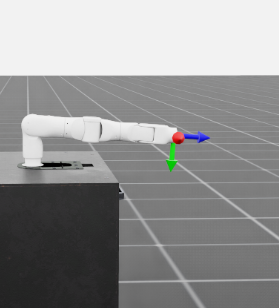

# OneRobotics A1 — Isaac Lab Integration

[OneRobotics](http://www.onerobot.com/) develops the **OneRobotics A1**, a 7-DoF fixed-base robotic arm.



*OneRobotics A1 at the all-joint-zero pose in the Isaac Lab reach environment.*

> This repository is the current external Isaac Lab implementation of the OneRobotics A1 robotic arm and is being prepared as a candidate upstream contribution. No proposal attachment or pull request containing the physical assets will be submitted until their redistribution rights are confirmed in writing.

The repository provides an Isaac Lab articulation configuration, a manager-based end-effector reach task, RSL-RL training and playback scripts, and a MuJoCo sim-to-sim validation path. It is not an official Isaac Lab asset or task.

## Project status

- The proposed upstream scope is the **OneRobotics A1 robot asset and Isaac Lab articulation configuration**, subject to written clearance of the asset redistribution rights.
- The reach task is validation material; maintainers may choose not to include it upstream.
- Final placement in `isaaclab_contrib`, `isaaclab_assets`, or another package has not been decided.
- The legacy `h1_reach` package name and `Template-A1-Reach-*` Gym IDs are intentionally retained during Phase 1 to avoid breaking existing users.
- An authentic Isaac Lab render is included above. It is derived from the same `REVIEW_REQUIRED` physical asset set and does not change the asset-license status.

## Features

- `A1_RIGHT_CFG`: fixed-base OneRobotics A1 right-arm articulation with seven joints, implicit PD actuators, effort and velocity limits, and configured armature.
- Portable asset loading: Isaac Lab imports the packaged A1 URDF at runtime instead of referencing a developer-local USD path.
- Manager-based reach task derived from Isaac Lab's manipulation reach example.
- Reachable-by-construction pose commands sampled from joint limits and evaluated with forward kinematics.
- Position-and-orientation observations and multi-scale pose rewards.
- RSL-RL training and policy playback.
- MuJoCo sim-to-sim playback with position-servo and explicit motor-PD modes.

## Software compatibility

The upstream compatibility target is the Isaac Lab `release/3.0.0-beta2` branch. The branch requires Python 3.12 and the Isaac Sim 6.0 generation; follow the [Isaac Lab installation guide](https://isaac-sim.github.io/IsaacLab/release/3.0.0-beta2/source/setup/installation/index.html) for the complete environment.

The following versions were available for local validation on 2026-08-14:

| Component | Version or baseline |
| --- | --- |
| Python | 3.12.13 |
| Isaac Sim | 6.0.1.0 |
| Local Isaac Lab runtime | dirty `v3.0.0-beta` checkout at `a4a7602` |
| Isaac Lab API review target | `release/3.0.0-beta2` at `2e44ddb` |
| RSL-RL | 5.0.1 |
| MuJoCo | 3.8.0 |

The exact checks performed, including checks that could not be run against an installed beta2 runtime, are recorded in [`OPEN_SOURCE_PREP.md`](OPEN_SOURCE_PREP.md).

## Installation

Install Isaac Lab first, activate its Python 3.12 environment, then clone and install this external extension:

```bash
git clone https://github.com/katazen/onerobot_h1.git
cd onerobot_h1
python -m pip install -e source/h1_reach
```

The extension assumes that `isaaclab`, `isaaclab_tasks`, and `isaaclab_rl` are supplied by the selected Isaac Lab installation. MuJoCo validation is optional and requires the `mujoco` Python package in the environment used to run `scripts/sim2sim.py`.

## Training and playback

List the two legacy Gym registrations:

```bash
python scripts/list_envs.py
```

Start RSL-RL training:

```bash
python scripts/rsl_rl/train.py \
  --task=Template-A1-Reach-v0 \
  --num_envs=2048 \
  --headless
```

Play a trained checkpoint:

```bash
python scripts/rsl_rl/play.py \
  --task=Template-A1-Reach-Play-v0 \
  --checkpoint=/absolute/path/to/model.pt
```

This repository does not include a pre-trained policy. The play script exports a successful RSL-RL checkpoint to an `exported/policy.pt` file alongside the selected run.

## MuJoCo sim-to-sim validation

Pass the exported TorchScript policy explicitly so the script remains portable across clones:

```bash
python scripts/sim2sim.py \
  --policy=/absolute/path/to/exported/policy.pt \
  --control-mode=motor \
  --policy-quaternion-layout=xyzw
```

Isaac Lab `release/3.0.0-beta2` uses `xyzw` quaternions, while MuJoCo exposes `wxyz`; the explicit flag converts only the policy observation fields. The script retains `wxyz` as its default for compatibility with policies trained using the legacy sim2sim observation contract. `--control-mode=position` selects MuJoCo position servos. The default `motor` mode computes the configured PD torque explicitly and clips it to the same per-joint effort limits. This cleanup does not change the MJCF dynamics, geometry, control gains, or legacy default behavior.

## Repository layout

```text
scripts/
  list_envs.py                 # list the external project's Gym environments
  rsl_rl/{train,play}.py       # RSL-RL training and playback
  sim2sim.py                   # MuJoCo sim-to-sim playback
source/h1_reach/
  config/extension.toml        # Omniverse/Isaac Lab extension metadata
  h1_reach/
    robots/a1.py               # OneRobotics A1 articulation configuration
    tasks/manager_based/
      h1_reach/                # legacy package path for the reach task
    assets/
      urdf/                    # single-arm and dual-arm URDF models
      meshes/                  # STL geometry
      mjcf/                    # MuJoCo models
```

The `robots/a1.py` module does not import reach-task code. The legacy top-level package still registers the task eagerly, so final package separation and lazy exports remain a Phase 2 decision.

## Licensing

The Python/code package metadata uses BSD-3-Clause, consistent with the root [`LICENSE`](LICENSE). The root license currently names **万昕**, not OneRobotics, as its copyright holder; this cleanup does not change that statement. Files copied or substantially derived from Isaac Lab retain their existing Isaac Lab Project Developers copyright and BSD-3-Clause SPDX notices. See [`THIRD_PARTY_NOTICES.md`](THIRD_PARTY_NOTICES.md).

The physical robot assets do **not** currently have a confirmed redistribution-license scope. Their status is `REVIEW_REQUIRED`; the repository-level code license must not be interpreted as an asset license. See [`ASSET_LICENSE_STATUS.md`](ASSET_LICENSE_STATUS.md) before redistributing URDF, MJCF/XML, STL, or converted USD assets.

## Upstream contribution

After the physical-asset redistribution rights are confirmed in writing, the next step is a Proposal issue asking the Isaac Lab maintainers to confirm package placement and whether the assets should move to a dedicated OneRobotics repository. No upstream directory layout, package rename, hosted asset URL, or final PR structure is assumed here. Do not publish an asset-bearing wheel, release, proposal attachment, or pull request while the asset status remains `REVIEW_REQUIRED`.

See [`OPEN_SOURCE_PREP.md`](OPEN_SOURCE_PREP.md) for the Phase 1 audit, test results, unresolved licensing work, and the Phase 2 plan.
